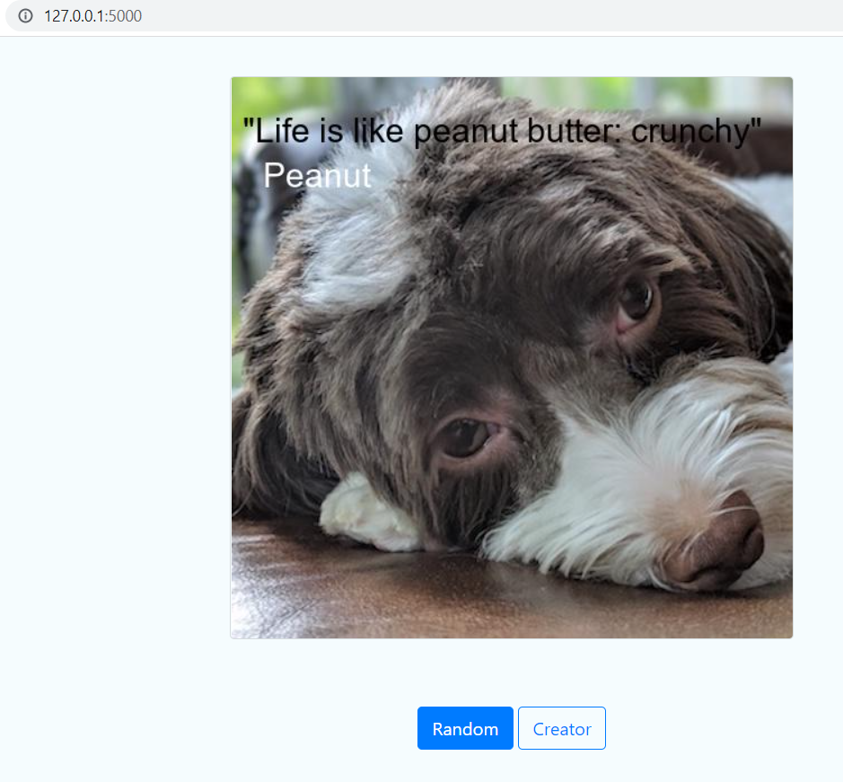

# Udacity-Project-Meme-Generator
This is the second project of mine to grauate the second course in **UDACITY** NanoDegree **Python Intermediate**   
The source code read text from different file exensions such as pdf, txt and docx files. The reading of file extensions is done using abstraction and polygamy programming concepts.


## Project Overview
- This project was developed on Widows 10
- The user should have a python 3.x on Desktop and add it to PATH variable as described [here](https://www.educative.io/answers/how-to-add-python-to-path-variable-in-windows)
- clone the project as follows  
```git clone https://github.com/abdulkarim723/Udacity-Second-Project-Meme-Generator.git```  
- install project requirements as follows  
```pip install -r requirements.txt```
## Create Meme from Terminal
- One can create meme using the terminal where the user can determine the path of the photo, the quote and the author from terminal as follows  
```pythone.exe meme.py --path ./_data/photos/dog/xander_1.jpg --body "be or not to be" --author "Bobby bob"```  
- One should have something like this  

## Run the Project from Flask Framework
- From project src run the following command
```python.exe app.py```  
one should have something like that  
```
 * Serving Flask app 'app'                                                                                                                                                                                          
 * Debug mode: off                                                                                                                                                                                                 
 WARNING: This is a development server. Do not use it in a production deployment. Use a production WSGI server instead.                                                                                              
 * Running on http://127.0.0.1:5000                                                                                                                                                                                
 Press CTRL+C to quit 
```
- Open an internet browser and enter the folllowing url link  
```http://127.0.0.1:5000/```  
- One should see sothing similar to the following  

- You can use the button **random** to create random memes

